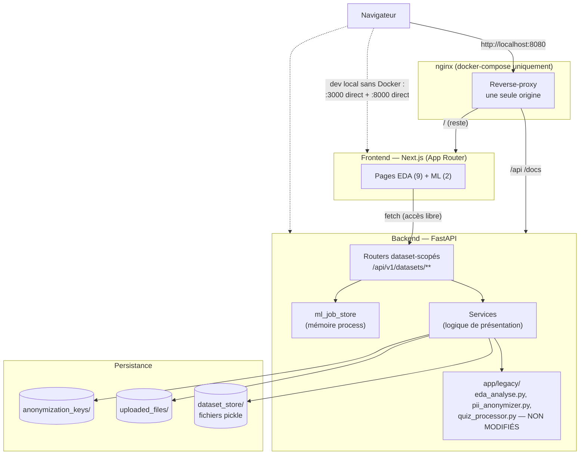
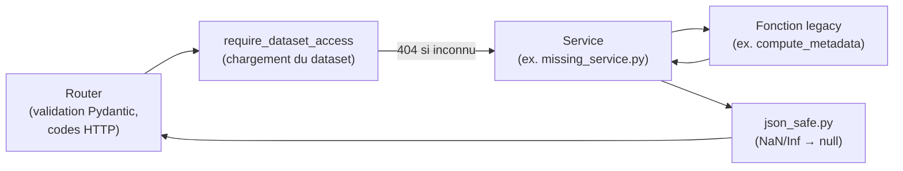
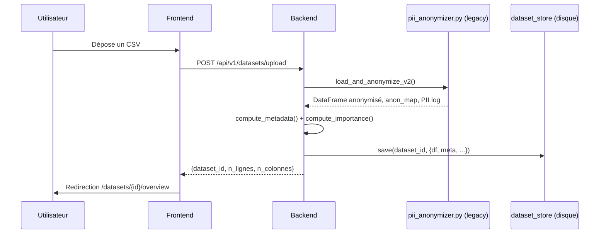
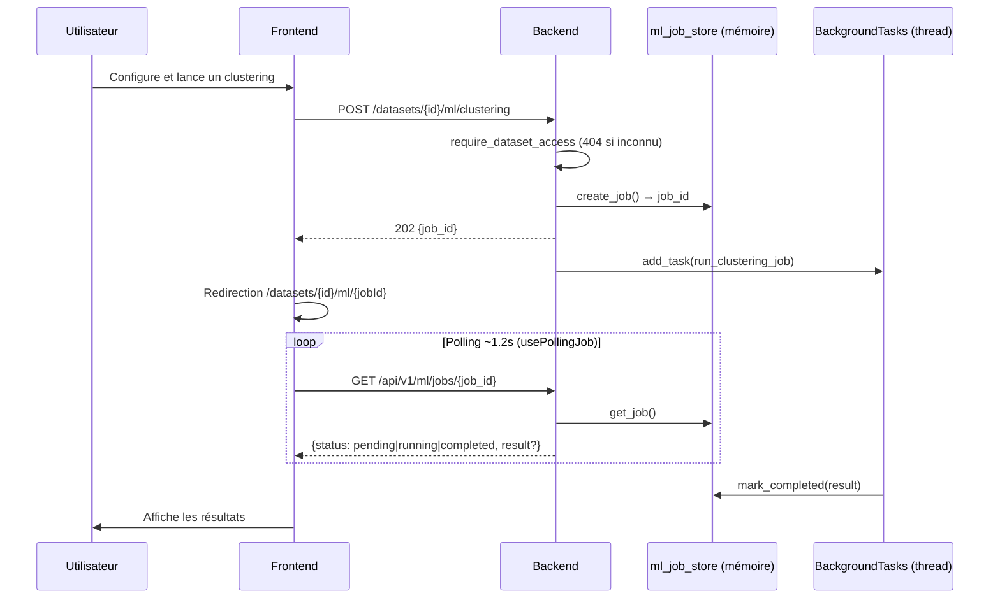

# Architecture

Vue d'ensemble structurelle du projet — pour le détail des décisions et de leurs justifications, voir le [Journal des décisions d'architecture](./README.md#journal-des-décisions-darchitecture) dans le README.

## 1. Vue d'ensemble du système



**Pourquoi un reverse-proxy.** Nginx (DQE-12) unifie frontend et backend sous une seule origine : le frontend appelle l'API en URLs relatives, ce qui supprime toute question de CORS cross-origin et rend le déploiement indépendant des noms d'hôte réels (voir `nginx/nginx.conf` et README §11.2).

**Accès libre.** L'application n'a aucune authentification : tous les endpoints sont publics et tout dataset est consultable via son identifiant. À ne pas exposer sur un réseau public avec des données réelles sans contrôle d'accès externe (VPN, proxy authentifiant).

**Pourquoi `app/legacy/` reste isolé.** L'intégralité de la logique métier Python (calcul des métadonnées, anonymisation PII, détection de champs quiz, génération de rapports LaTeX) vient du dépôt Streamlit d'origine, copiée sans modification. Les "services" du backend ne sont qu'une couche de traduction entre cette logique et des réponses JSON — voir §2.

## 2. Anatomie d'une requête — couches du backend



Chaque endpoint dataset-scopé (`/api/v1/datasets/{id}/...`) suit ce même chemin. La dépendance `require_dataset_access` (DQE-11, `app/services/dataset_access.py`) est réutilisée telle quelle sur les ~25 endpoints concernés plutôt que dupliquée. `json_safe.py` (DQE-7) neutralise les `NaN`/`Inf` produits par pandas/numpy avant la sérialisation JSON — un angle mort découvert en testant sur de vraies données (colonnes entièrement vides), documenté dans `app/services/json_safe.py`.

## 3. Flux — upload et anonymisation (DQE-6/7)



## 4. Flux — clustering asynchrone (DQE-8/10)



**Limite assumée** (DQE-8/12) : `ml_job_store` est en mémoire process, sans persistance ni coordination inter-instances — un redémarrage du backend perd les jobs en cours, et le backend ne doit pas être scalé horizontalement sans migrer ce store vers Redis (ou équivalent). Voir `app/services/ml_job_store.py` et README §11.4.

## 5. Contrôle d'accès — néant (accès libre)

Une couche d'authentification (fastapi-users, cookie JWT `httpOnly`, cloisonnement des datasets par `owner_id`, rôle admin) a existé en DQE-11 puis **a été entièrement retirée**. L'état actuel :

- Aucune route `/auth/**` ni `/users/**` ; aucune base de comptes (`users.db` supprimée).
- Aucune page `/login` ni `/register` ; aucun `middleware.ts` de garde de routes.
- `require_dataset_access` subsiste comme dépendance FastAPI sur les ~25 endpoints dataset-scopés, mais ne fait plus que **charger le dataset** et traduire un identifiant inconnu en `404`. Plus aucun `403` possible.
- `GET /api/v1/datasets/mine` retourne **tous** les datasets enregistrés.

Conséquence à assumer : quiconque atteint l'application peut uploader, lister et consulter n'importe quel dataset. Le contrôle d'accès, s'il est requis, doit être assuré en amont (réseau interne, VPN, proxy authentifiant).

## 6. Structure des dossiers

```
poc/
├── backend/
│   ├── app/
│   │   ├── main.py              # Point d'entrée FastAPI, CORS, montage des routers
│   │   ├── core/config.py        # Chemins, salt d'anonymisation, CORS, sys.path legacy
│   │   ├── legacy/                # eda_analyse.py, pii_anonymizer.py, quiz_processor.py — NON MODIFIÉS
│   │   ├── models/                # Schémas Pydantic (schemas.py)
│   │   ├── routers/               # 1 fichier par ressource — validation + codes HTTP uniquement
│   │   └── services/              # Logique de présentation/traduction (dataset_store, *_service.py)
│   ├── tests/                     # pytest — 51 tests (EDA, ML)
│   ├── Dockerfile
│   └── requirements.txt
├── frontend/
│   ├── app/
│   │   └── datasets/[id]/         # Layout partagé (sidebar, DatasetGuard) + 9 pages EDA + 2 pages ML
│   ├── components/
│   │   ├── ui/                    # Primitives shadcn-style (Button, Card, Table...)
│   │   ├── charts/                # Wrapper Plotly.js
│   │   ├── ml/                    # Composants spécifiques au clustering
│   │   └── layout/                # Sidebar, PageHeader, DatasetGuard
│   ├── lib/                       # Client API, DatasetContext, hooks
│   ├── e2e/                       # Tests Playwright (DQE-13)
│   ├── __tests__/                 # Tests Vitest — 32 tests
│   └── Dockerfile
├── nginx/nginx.conf               # Reverse-proxy (DQE-12)
├── docker-compose.yml
└── .github/workflows/ci.yml
```

## 7. Principes directeurs (récurrents dans le journal des décisions)

1. **Logique métier legacy jamais réécrite** — `app/legacy/` est une copie conforme, exclue du lint (`pyproject.toml`), jamais modifiée. Les services l'appellent et traduisent son résultat en JSON.
2. **Pas d'infrastructure anticipée** — SQLite plutôt que Postgres, fichiers plutôt que S3, `BackgroundTasks` plutôt que Celery/Redis : à chaque fois, la décision la plus simple qui répond au besoin réel du ticket en cours, avec la limite documentée explicitement plutôt que cachée.
3. **Limites assumées et écrites** — l'absence de contrôle d'accès est un choix explicite, documenté ici et dans le README (§ Limites connues), pas un oubli : le déploiement doit en tenir compte.
4. **Limites de vérification documentées explicitement** — quand un outil de vérification n'était pas disponible dans l'environnement de développement (Docker, navigateurs Playwright), ce projet le signale noir sur blanc plutôt que de prétendre une couverture qui n'a pas eu lieu (voir README §11.7, §12.6).
